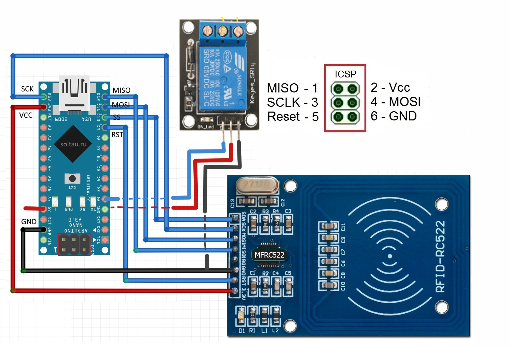

# rfid-relay-locker
An Arduino project for using RFID tags and it's UIDs as keys for triggering relays and open doors.

## Pinout

## Precondition
Before you go and buy one RFID-RC522 and start using this script, make sure your chip is working correctly.
There are hundreds of chip sellers and some ofthem are fakes or just broken. 

## First use
1. First download [this rfid library](https://github.com/FallenAngel666/rfid) which contains a fix for compilation issues.
2. Install the downloaded library to your Arduino library folder.
3. Install the sha library from libarary folder in current repo.Which was copied from [here](https://github.com/daknuett/cryptosuite2.
4. (optional) Prepare your RFID
	1. Use the examples to reset your RFID UID numbers to something else than the factory ones. (not necessary sincethey should be randomized)
	2. (advanced) Update the key A (and key B) if possible so it's no longer using the factory one.
5. Upon first test runs, you will see the hashed UID value in the serial console. Use the hash to set it as new "hashedUID".
6. Now you are able to use only your selected RFID for opening/closing the relay. 
	1. You may also override the same UID for other cards and use them too or update the code to use a list of UID hashes. 
	
## Troubleshooting
- if you see that we cannot connect to your RFID, probable your manufacturer uses different keys. 
Try [this example script](https://github.com/FallenAngel666/rfid/blob/master/examples/rfid_default_keys/rfid_default_keys.ino) to figure out which key to use.
